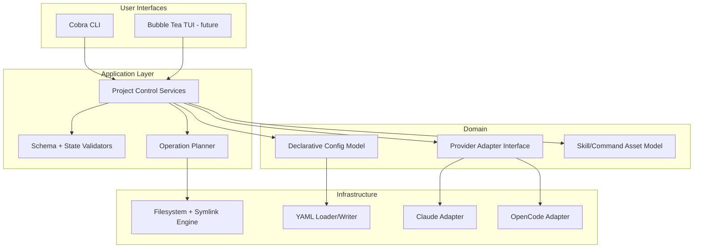

# PRD: Weave (Working Title)

> **Weave agents and skills into any project with reproducible symlink-based setup.**

**Version**: 0.1.0-draft  
**Author**: JF (with AI facilitation)  
**Date**: 2026-04-15  
**Status**: Draft

---

## 1. Problem Statement

AI-assisted coding workflows are powerful, but per-project setup is fragmented and inconsistent.

Today, developers who use Claude Code, OpenCode, and custom skills/commands face recurring friction:

1. **Project bootstrap is manual**: each repository needs repetitive setup steps.
2. **Agent setup is not reproducible**: symlinks, files, and local conventions vary by machine.
3. **Skills/commands reuse is clumsy**: useful assets exist in personal directories but are hard to apply consistently per project.
4. **Onboarding is slow**: collaborators cannot reliably reproduce the same AI-enabled project environment.
5. **No control plane**: there is no single declarative source of truth for project-level AI tooling.

Most developers end up in one of these states:

- They keep ad-hoc scripts per repository.
- They manually copy/paste skills and commands.
- They avoid standardization because setup overhead is too high.

**Weave solves this by providing a declarative, reproducible project setup workflow** for AI coding agents, starting with Claude Code and OpenCode.

---

## 2. Vision

**Project-level AI setup should be declarative, portable, and symlink-native.**

This product is NOT a global AI-agent installer. It is a **project control plane** that:

- Initializes project-local AI structure.
- Configures selected providers (Claude Code, OpenCode first).
- Applies agent-specific links/templates in a repeatable way.
- Imports relevant skills and commands from user-managed libraries.
- Keeps everything represented in a single declarative file (`weave.yaml`).

Weave follows a two-layer model:

1. **Source layer (user-level):** centralized local catalogs for reusable assets (skills and commands).
2. **Project layer:** explicit installation into each project via symlinks + declarative inventory in `weave.yaml`.

For v1, source layer support is **local filesystem only** (`~/.weave/skills` and `~/.weave/commands` by default). Any marketplace/remote registry behavior is post-v1.

**Before**: “Every repo has a different manual setup; I forgot half the steps.”

**After**: `weave forge && weave provider add claude-code && weave skill add my-skill` → project is configured predictably and versionable.

---

## 3. Target Users

### Primary

- **AI-heavy solo developers** who want repeatable project setup.
- **Open-source maintainers** who want clear bootstrap conventions for contributors.
- **Power users of Claude Code/OpenCode** managing multiple repositories.

### Secondary

- **Small teams** standardizing AI-assisted development conventions.
- **Developers building public templates/starter repos**.
- **Platform-minded engineers** creating internal standards for AI tooling.

---

## 4. Supported Platforms

| Platform              | Priority | Notes                             |
| --------------------- | -------- | --------------------------------- |
| macOS (Apple Silicon) | P0       | Initial target platform           |
| macOS (Intel)         | P0       | Same behavior as Apple Silicon    |
| Linux (Ubuntu/Debian) | P1       | First expansion target            |
| Linux (Arch/Fedora)   | P2       | Community-driven support possible |
| WSL2                  | P2       | After Linux baseline is stable    |
| Windows (native)      | P3       | Out of initial scope              |

---

## 5. Prerequisites & Dependency Management

The first release is CLI-first and project-scoped. It should not force unnecessary global dependencies and should be installable as a single binary for core behavior.

### 5.0.1 Dependency Resolution Strategy

1. Detect runtime and current project path.
2. Detect required provider tools based on user selection.
3. Validate external paths for shared skills/commands.
4. Apply config and file operations with explicit confirmation when risky.
5. Verify resulting project structure and provider hooks.

### 5.0.2 System-Level Dependencies

| Dependency                                         | Required    | Why                                               |
| -------------------------------------------------- | ----------- | ------------------------------------------------- |
| Go runtime (for distributed binary execution only) | No          | End users consume compiled binary                 |
| `git`                                              | Recommended | Versioning project config and generated structure |
| Provider CLIs (Claude/OpenCode)                    | Conditional | Required only for selected providers              |
| Filesystem symlink support                         | Yes         | Core setup mechanism for provider integration     |

### 5.0.3 Provider Validation Strategy

| Scenario                           | Action                                                            |
| ---------------------------------- | ----------------------------------------------------------------- |
| Provider selected and CLI detected | Configure provider integration                                    |
| Provider selected but CLI missing  | Warn and continue with scaffold-only mode OR fail (based on flag) |
| Unsupported provider name          | Reject with clear supported list                                  |
| Provider partially configured      | Run `doctor` guidance and suggest repair command                  |

### 5.0.4 Requirements

- R-DEP-01: CLI MUST detect project root and refuse unsafe operations outside user-selected scope.
- R-DEP-02: CLI MUST validate required provider binaries before claiming provider setup success.
- R-DEP-03: CLI MUST support a `--dry-run` mode for all mutating commands.
- R-DEP-04: CLI MUST provide readable failure messages with actionable next steps.
- R-DEP-05: CLI MUST not require TUI dependencies in v1.
- R-DEP-06: v1 distribution MUST support one-command installation of the Weave binary (core CLI ready to run).
- R-DEP-07: Core CLI commands MUST be shell-agnostic (work from any shell that can invoke an executable in `PATH`, e.g. bash/zsh/fish).

---

## 6. Components to Install & Configure

### 6.1 Core Project Bootstrap

Creates baseline structure and declarative config.

| Component    | Purpose                                                              |
| ------------ | -------------------------------------------------------------------- |
| `weave.yaml` | Source of truth for setup intent                                     |
| `.agents/`   | Canonical directory with shared instructions, skills, commands, docs |
| `.claude/`   | Claude adapter directory (symlinks to `.agents`)                     |
| `.opencode/` | OpenCode adapter directory (symlinks to `.agents`)                   |

**Requirements:**

- R-CORE-01: `forge` MUST be idempotent.
- R-CORE-02: `forge` MUST avoid overwriting existing files without explicit user consent.
- R-CORE-03: `forge` MUST create minimal defaults to keep first run simple.

#### 6.1.1 Canonical v1 Structure (validated from `centro-control`)

```text
.agents/
├── AGENTS.md
├── commands/
├── docs/
└── skills/

.claude/
├── CLAUDE.md      -> ../.agents/AGENTS.md
├── commands       -> ../.agents/commands
└── docs           -> ../.agents/docs

.opencode/
├── AGENTS.md      -> ../.agents/AGENTS.md
├── commands       -> ../.agents/commands
└── docs           -> ../.agents/docs
```

#### 6.1.2 AGENTS as Dynamic Skills Directory (future-compatible design)

- v1 ships with `.agents/AGENTS.md` as central instructions file.
- The architecture MUST allow generating/updating this file from selected skills in future versions.
- User-added skills should be injectable into AGENTS composition without breaking provider adapters.

### 6.2 Provider Support (Initial)

Initial provider set focuses on highest value:

| Provider    | Priority | Mode             |
| ----------- | -------- | ---------------- |
| Claude Code | P0       | Full integration |
| OpenCode    | P0       | Full integration |

**Requirements:**

- R-PROV-01: CLI MUST allow enabling multiple providers in one project.
- R-PROV-02: Provider integration MUST be implemented through provider adapters (interface-based design).
- R-PROV-03: Provider operations MUST be reversible (remove/repair).

### 6.3 Skills Management

The user has a centralized local shared skills directory and can import relevant skills into the current project.

| Operation             | Behavior                                                             |
| --------------------- | -------------------------------------------------------------------- |
| `skill add <name>`    | Adds skill via symlink into project-local canonical skills directory |
| `skill list`          | Lists available shared skills + installed project skills             |
| `skill remove <name>` | Removes local project skill symlink/reference                        |

**Requirements:**

- R-SKILL-01: Conflicts (same filename) MUST prompt: overwrite / skip / backup.
- R-SKILL-02: CLI SHOULD support non-interactive conflict flags (`--overwrite`, `--skip`, `--backup`).
- R-SKILL-03: Source skills directory MUST be configurable in `weave.yaml` and overridable via flag/env.
- R-SKILL-04: v1 synchronization mode for skills MUST be `symlink` (not copy).
- R-SKILL-05: Default shared skills directory in v1 MUST be `~/.weave/skills`.

### 6.4 Commands Management

Same model as skills, but for reusable custom commands.

| Operation               | Behavior                                                                 |
| ----------------------- | ------------------------------------------------------------------------ |
| `command add <name>`    | Adds command via symlink into project-local canonical commands directory |
| `command list`          | Lists available shared commands + installed project commands             |
| `command remove <name>` | Removes local project command symlink/reference                          |

**Requirements:**

- R-CMD-01: Commands import path and lifecycle MUST mirror skill ergonomics.
- R-CMD-02: Command metadata SHOULD support provider compatibility markers in future versions.
- R-CMD-03: v1 synchronization mode for commands MUST be `symlink` (not copy).
- R-CMD-04: Default shared commands directory in v1 MUST be `~/.weave/commands`.

### 6.5 Declarative File (`weave.yaml`)

```yaml
version: 1
project:
  name: "my-project"
providers:
  - name: claude-code
    enabled: true
  - name: opencode
    enabled: true
skills:
  - name: sdd-orchestrator
    source: "~/.weave/skills/sdd-orchestrator"
commands:
  - name: pr-review
    source: "~/.weave/commands/pr-review.md"
sources:
  skills_dir: "~/.weave/skills"
  commands_dir: "~/.weave/commands"
sync:
  mode: symlink
  conflict_policy: prompt
```

**Requirements:**

- R-CONFIG-01: YAML schema MUST be versioned.
- R-CONFIG-02: CLI MUST validate schema before mutating filesystem.
- R-CONFIG-03: CLI MUST support deterministic regeneration from config.
- R-CONFIG-04: `sync.mode` MUST be fixed to `symlink` in v1.
- R-CONFIG-05: `weave.yaml` MUST store explicit desired inventory of installed skills and commands.
- R-CONFIG-06: `skill add` and `command add` MUST update `weave.yaml` atomically after successful filesystem operations.
- R-CONFIG-07: v1 persistence policy MUST be `strict`: if symlink creation fails, `weave.yaml` MUST NOT be updated.

---

## 7. User Experience

### 7.1 CLI-first Flow (v1)

> Examples below are shell-agnostic CLI invocations (bash/zsh/fish/pwsh when `weave` is in `PATH`).

```sh
weave forge
weave provider add claude-code
weave provider add opencode
weave skill add sdd-orchestrator
weave command add pr-review
weave skill list
weave command list
weave doctor
```

### 7.2 Planned TUI Flow (v2)

Bubble Tea UI will be layered on top of existing command/service primitives:

1. Detect project and current state.
2. Show provider selection screen.
3. Show skills/commands catalog from configured sources.
4. Preview file operations.
5. Apply changes and stream status.

### 7.3 UX Requirements

- R-UX-01: All mutating commands MUST display a concise operation summary.
- R-UX-02: `doctor` MUST explain both current status and repair path.
- R-UX-03: UX language MUST prioritize actionability over verbosity.
- R-UX-04: CLI output SHOULD be script-friendly (`--json`) for automation use cases.
- R-UX-05: On strict-mode failures, CLI MUST surface clear rollback semantics: “no filesystem partial state committed to config”.

### 7.4 Initial Command Set

| Command          | Purpose                              |
| ---------------- | ------------------------------------ |
| `forge`          | Bootstrap project structure          |
| `provider add`   | Add provider setup                   |
| `skill add`      | Add project-local skill symlink      |
| `skill list`     | List shared + installed skills       |
| `skill remove`   | Remove project-local skill symlink   |
| `command add`    | Add project-local command symlink    |
| `command list`   | List shared + installed commands     |
| `command remove` | Remove project-local command symlink |
| `doctor`         | Validate and diagnose setup          |

**v1 Explicit Scope Cut:**

- Included: `forge`, `provider add`, `skill add`, `skill list`, `skill remove`, `command add`, `command list`, `command remove`, `doctor`.
- Excluded: `apply` (post-v1).

---

## 8. Technical Architecture

### 8.0 Architecture Principles

1. **Declarative first**: config is source of truth.
2. **Adapter pattern**: each provider isolated behind stable interface.
3. **Core reuse**: CLI and future TUI call the same application services.
4. **Idempotency**: repeated operations converge to expected state.

### 8.1 High-Level Diagram



### 8.2 Suggested Module Structure

```text
cmd/weave/                # entrypoint
internal/cli/             # cobra commands
internal/app/             # use-cases/services
internal/domain/          # entities + interfaces
internal/providers/       # provider adapters
internal/config/          # schema + viper/yaml handling
internal/fsops/           # copy/link/backup/reconcile
internal/doctor/          # diagnostics
```

### 8.3 Provider Interface (Conceptual)

```go
type ProviderAdapter interface {
  Name() string
  Detect(ctx context.Context) (DetectionResult, error)
  Plan(ctx context.Context, project ProjectState, cfg Config) ([]Operation, error)
  Apply(ctx context.Context, ops []Operation) error
  Verify(ctx context.Context, project ProjectState) (VerifyReport, error)
}
```

### 8.4 Config Precedence

1. CLI flags
2. Environment variables
3. `weave.yaml`
4. Internal defaults

### 8.4.1 Desired-State Reconciliation Model (v1 scope)

- `weave.yaml` is the desired state contract for providers + skills + commands.
- v1 command set is `forge`, `provider add`, `skill add`, `skill list`, `skill remove`, `command add`, `command list`, `command remove`, and `doctor`.
- Mutating commands (`forge`, `provider add`, `skill add`, `skill remove`, `command add`, `command remove`) MUST keep desired state in sync with `weave.yaml`.
- `doctor` MUST report drift between filesystem symlinks and `weave.yaml` inventory.

### 8.5 Architecture Requirements

- R-ARCH-01: Core business logic MUST remain UI-agnostic.
- R-ARCH-02: Provider-specific code MUST NOT leak into command handlers.
- R-ARCH-03: Operation planner MUST support dry-run and real-run using same plan primitives.
- R-ARCH-04: TUI integration MUST be possible without refactoring domain contracts.
- R-ARCH-05: Canonical data lives in `.agents`; provider directories are projections via symlinks.
- R-ARCH-06: Inventory persistence in `weave.yaml` MUST be treated as transactional state (no partial writes).
- R-ARCH-07: Symlink operation + config write MUST behave as a single logical transaction in v1 strict mode.

---

## 9. Distribution & Installation

### v1 Distribution Strategy

| Channel                              | Priority |
| ------------------------------------ | -------- |
| Homebrew tap                         | P0       |
| Precompiled GitHub Releases binaries | P0       |
| `go install` (for contributors)      | P1       |

### Requirements

- R-DIST-01: Provide signed checksums for release artifacts.
- R-DIST-02: Installation instructions MUST include quickstart and minimal troubleshooting.
- R-DIST-03: Binary naming and versioning MUST follow semver.

---

## 10. Update & Maintenance

### Update Strategy

- `weave self update` (future) or package-manager-driven updates.
- Backward-compatible config migrations by schema version.

### Requirements

- R-UPD-01: CLI MUST detect outdated config schema and suggest/perform migration.
- R-UPD-02: Breaking changes MUST include migration guide in release notes.
- R-UPD-03: `doctor` MUST flag stale provider integrations after upgrades.

---

## 11. Post-Install Experience

After install, user should be able to run:

```bash
weave --help
weave forge
weave provider add claude-code
weave doctor
```

Expected outcome:

- The project has a clean baseline.
- User understands what to do next.
- Team can commit `weave.yaml` and reproduce setup.
- Team can review exact skills/commands inventory in PRs via `weave.yaml` diff.

### Requirements

- R-POST-01: Help text MUST include 60-second quickstart.
- R-POST-02: First-run experience SHOULD recommend next commands contextually.
- R-POST-03: Errors MUST include docs reference paths/URLs.

---

## 12. Non-Functional Requirements

| Category        | Requirement                                                                             |
| --------------- | --------------------------------------------------------------------------------------- |
| Reliability     | Idempotent operations and safe retries                                                  |
| Performance     | Typical operations should complete in <2s on local filesystem for small/medium projects |
| Security        | No secret exfiltration; no reading `.env` unless explicitly requested                   |
| Maintainability | Clear adapter boundaries and testable service layer                                     |
| Portability     | Path handling and symlink logic abstracted for platform differences                     |
| Observability   | Structured logs for debug mode                                                          |

### NFR Requirements

- R-NFR-01: All mutating operations MUST support backup-on-write for risky paths.
- R-NFR-02: CLI MUST return deterministic exit codes.
- R-NFR-03: Core services MUST have unit test coverage for critical paths.

---

## 13. Verification Strategy (TDD + SDD)

Testing and delivery follow **TDD execution** with **SDD traceability**:

- **TDD** defines implementation behavior through failing tests first.
- **SDD** ensures every implemented behavior maps to a documented requirement.
- The test suite is the executable contract proving requirement compliance.

### 13.1 Test Levels

| Level | Scope | Primary Goal | Typical Targets |
|-------|-------|--------------|-----------------|
| Unit | Single function/service/module | Validate business rules and edge cases quickly | config validators, planners, path resolution, inventory reconciliation |
| Integration | Multiple modules + filesystem boundaries | Validate transactional behavior and adapter orchestration | symlink + config write sequence, provider adapter wiring, doctor diagnostics |
| E2E (CLI) | Real CLI command invocation in sandbox project | Validate user-visible workflows and exit semantics | `forge`, `provider add`, `skill/command add/list/remove`, `doctor` |

### 13.2 Requirement-to-Test Rule (mandatory)

For every requirement (`R-*`):

- At least **1 success-path test**.
- At least **1 error/edge-case test**.
- At least **1 observable acceptance criterion** (CLI output, filesystem state, config state, exit code, or JSON contract).

This rule applies before a requirement is considered done.

### 13.3 Requirement → Tests Traceability Matrix (v1 critical set)

| Requirement | Unit Test(s) | Integration Test(s) | E2E Test(s) | Observable Acceptance Criteria |
|-------------|--------------|---------------------|-------------|-------------------------------|
| R-CORE-01 (`forge` idempotent) | planner returns no-op for already-converged state | repeated apply produces same filesystem plan outcome | run `weave forge` twice on same repo | second run has no destructive changes; exit code `0` |
| R-CONFIG-07 (strict transactional persistence) | config writer not called when symlink op fails | simulated symlink failure rolls back config mutation | `weave skill add` to invalid destination | `weave.yaml` unchanged; non-zero exit; actionable error |
| R-DEP-07 (shell-agnostic CLI) | argument parser independent from shell-specific syntax | command resolution from PATH in isolated env setups | invoke same command from bash/zsh/fish harness | same behavior and exit codes across shells |
| R-NFR-02 (deterministic exit codes) | domain errors map to fixed code enum | adapter/fs errors propagate stable mapped codes | invalid command state and success path checks | repeated same scenario => identical exit code |
| R-SKILL-04 / R-CMD-03 (symlink-only sync) | operation planner emits symlink ops only | fs executor rejects copy fallback in v1 mode | add skill/command and inspect resulting links | installed assets are symlinks; no copied payload |

### 13.4 Definition of Done (per critical requirement)

A critical requirement is Done only when all conditions are met:

1. Requirement has traceability entry in the matrix.
2. Success-path and error/edge tests are implemented and passing.
3. Observable acceptance criterion is validated in at least one integration or E2E test.
4. `doctor` behavior is covered when requirement affects state/drift semantics.
5. Test names and cases are linked in implementation task/spec artifacts (SDD tasks).

### 13.5 Testing Scope for v1

- **Must be explicitly listed in planning artifacts:**
  - Critical-path tests tied to `R-*` requirements.
  - Regression tests for previously fixed defects.
- **May be derived during implementation:**
  - Additional low-risk unit permutations that do not change acceptance semantics.

The PRD defines the mandatory verification contract; detailed test case expansion is maintained in SDD specs/tasks to keep the PRD focused and maintainable.

---

## 14. Future Considerations (Out of Scope for v1)

1. Bubble Tea TUI full workflow.
2. Provider marketplace (community adapters).
3. Remote skill registries with signatures.
4. Team policy bundles and validation gates.
5. `weave sync` with two-way drift detection.
6. Native Windows support.
7. Automatic download/install of skills or commands from remote catalogs.
8. Global auto-provisioning of assets across all client tools.

> Clarification: marketplace/registry-driven asset installation and global auto-distribution are intentionally out of scope for v1.

---

## 15. Success Metrics

### 30-day Success Criteria (as defined by product intent)

1. Public package downloadable for macOS.
2. Working command suite without TUI:
   - `forge`
   - `provider add`
   - `skill add`
   - `skill list`
   - `skill remove`
   - `command add`
   - `command list`
   - `command remove`
   - `doctor`
3. Supports Claude Code + OpenCode adapters.
4. Declarative config file governs setup behavior.

### Quantitative Targets

- M-01: Time-to-first-working-setup under 2 minutes for a new project.
- M-02: 95%+ success rate on `doctor` for freshly initialized sample projects.
- M-03: At least 5 external users run the bootstrap flow and provide feedback.

---

## 16. Open Questions

1. What migration strategy should be used for users with existing `~/.agents` assets?
2. What minimal telemetry (if any) is acceptable for OSS without privacy concerns?
3. Should AGENTS composition be generated automatically in v1.1 or remain manual until v2?
4. How should provider-specific prerequisite installation be handled without breaking the “single install command” expectation for users?

---

## Appendix A: Competitive Landscape

| Category                 | Examples                      | Gap This Product Fills                      |
| ------------------------ | ----------------------------- | ------------------------------------------- |
| Dotfiles / env bootstrap | chezmoi, yadm, custom scripts | Not project-AI-workflow focused             |
| Project templates        | cookiecutter, degit starters  | Weak lifecycle control after scaffold       |
| AI agent tooling         | provider-specific setups      | Poor multi-provider project standardization |

Strategic position:

- Not trying to replace agent CLIs.
- Not trying to be generic config manager.
- Focused on **project-scoped AI setup orchestration**.

---

## Appendix B: Example Non-Interactive Commands

```sh
# Initialize project with defaults
weave forge --yes

# Enable both initial providers
weave provider add claude-code --yes
weave provider add opencode --yes

# Import skills and commands from custom source directories
weave skill add sdd-orchestrator --from "~/.weave/skills" --yes
weave command add pr-review --from "~/.weave/commands" --yes

# CI-oriented diagnostics
weave doctor --json
```
